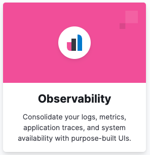
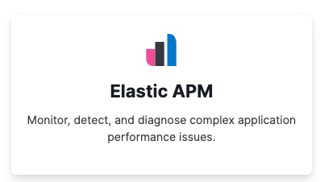
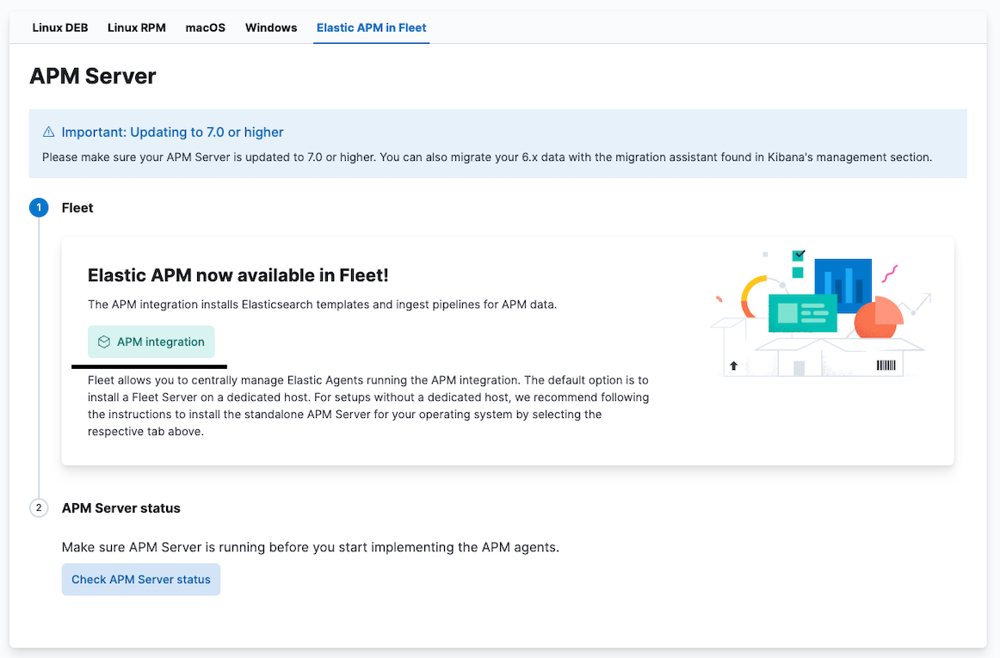

Hello!

The gide for fast setup observability system for local projects

Step by step guid

1. Move to dev-tools folder.
2. Run docker compose file (docker-compose up)
3. Go to kibana (http://localhost:5601)
4. Enter credentials (login: elastic; password: elastic) or use anonymous user
5. Go to home page (http://localhost:5601/app/home#/)
6. Click on Observability card



7. Click "Add integrations"
8. Click "Elastic APM"



9. Click "Add integration"



10. Click "Add Elastic APM"
11. Click "Save and continue"
12. Click "Add Elastic Agent Later"
13. Run Weather API project
14. Make call in swagger
15. Now you can see logs in Logs -> Stream (exist possibilities for filtering by service name "service.name : "Weather_API"")
16. In APM -> Services you can find your services
17. Click by service
18. Here you can find Metrics tab witch show all service metrics
20. On Transaction tab you can see all your endpoints and if click on them you can see traces of this call and logs associated with trace scope

Links:

https://www.meziantou.net/monitoring-a-dotnet-application-using-opentelemetry.htm


Setup service for CA certificates
```
  setup:
    image: elasticsearch:${STACK_VERSION}
    networks:
      - shared
    volumes:
      - certs:/usr/share/elasticsearch/config/certs
    user: "0"
    command: >
      bash -c '
        if [ x${ELASTIC_PASSWORD} == x ]; then
          echo "Set the ELASTIC_PASSWORD environment variable in the .env file";
          exit 1;
        elif [ x${KIBANA_PASSWORD} == x ]; then
          echo "Set the KIBANA_PASSWORD environment variable in the .env file";
          exit 1;
        fi;
        if [ ! -f config/certs/ca.zip ]; then
          echo "Creating CA";
          bin/elasticsearch-certutil ca --silent --pem -out config/certs/ca.zip;
          unzip config/certs/ca.zip -d config/certs;
        fi;
        if [ ! -f config/certs/certs.zip ]; then
          echo "Creating certs";
          echo -ne \
          "instances:\n"\
          "  - name: elastic\n"\
          "    dns:\n"\
          "      - elastic\n"\
          "      - localhost\n"\
          "    ip:\n"\
          "      - 127.0.0.1\n"\
          "  - name: kibana\n"\
          "    dns:\n"\
          "      - kibana\n"\
          "      - localhost\n"\
          "    ip:\n"\
          "      - 127.0.0.1\n"\
          > config/certs/instances.yml;
          bin/elasticsearch-certutil cert --silent --pem -out config/certs/certs.zip --in config/certs/instances.yml --ca-cert config/certs/ca/ca.crt --ca-key config/certs/ca/ca.key;
          unzip config/certs/certs.zip -d config/certs;
        fi;
        echo "Setting file permissions"
        chown -R root:root config/certs;
        find . -type d -exec chmod 750 \{\} \;;
        find . -type f -exec chmod 640 \{\} \;;
        echo "Waiting for Elasticsearch availability";
        until curl -s --cacert config/certs/ca/ca.crt http://elastic:9200 | grep -q "missing authentication credentials"; do sleep 30; done;
        echo "Setting kibana_system password";
        until curl -s -X POST -u elastic:elastic -H "Content-Type: application/json" http://elastic:9200/_security/user/kibana_system/_password -d "{\"password\":\"kibana\"}" | grep -q "^{}"; do sleep 10; done;
        echo "All done!";
      '
    healthcheck:
      test: ["CMD-SHELL", "[ -f config/certs/elastic/elastic.crt ]"]
      interval: 1s
      timeout: 5s
      retries: 120
```